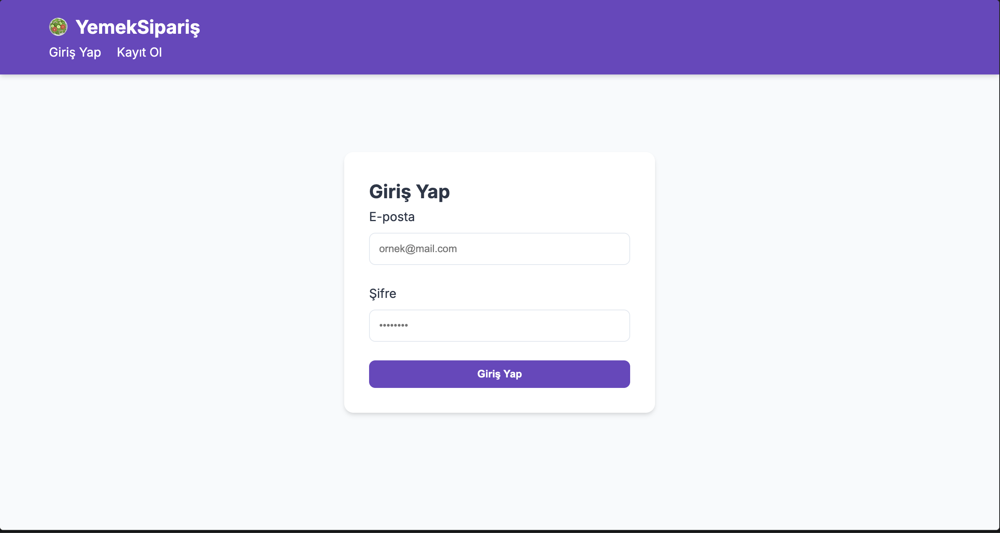
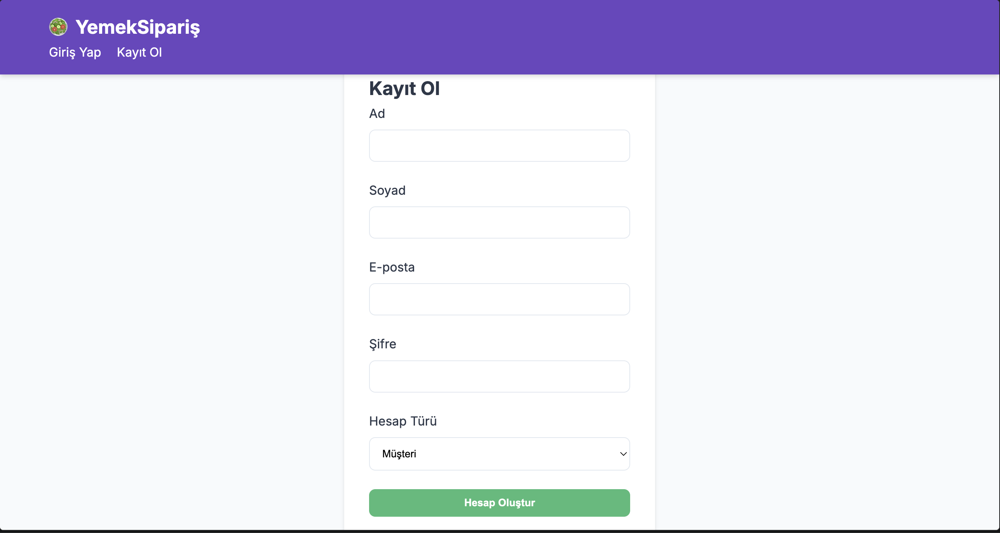
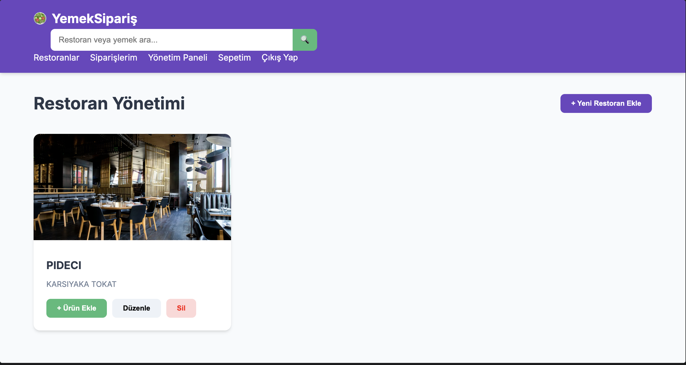
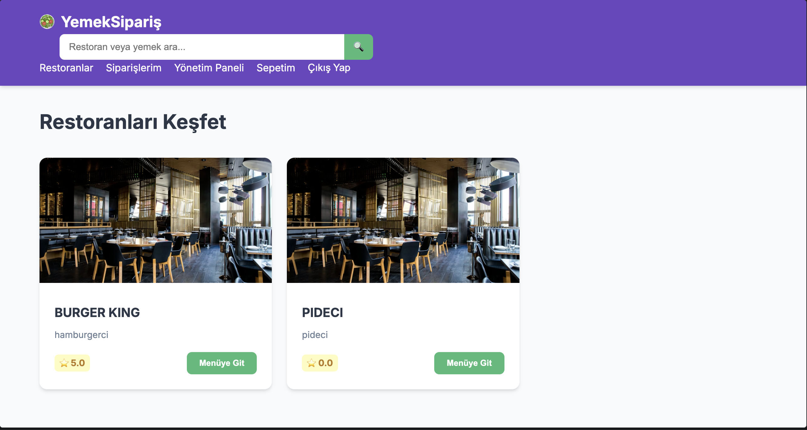
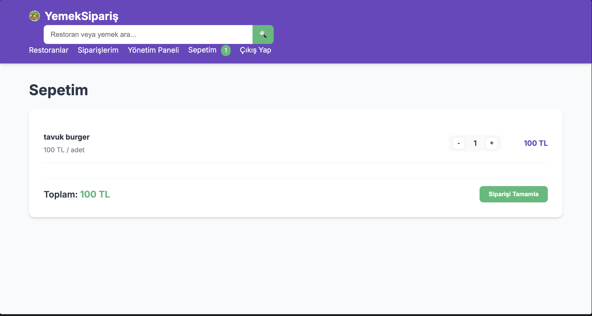
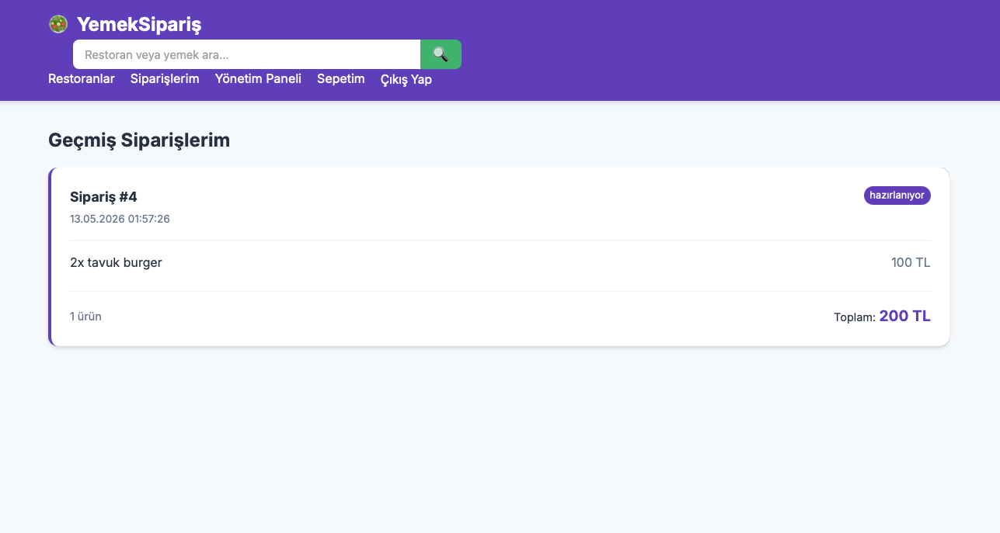
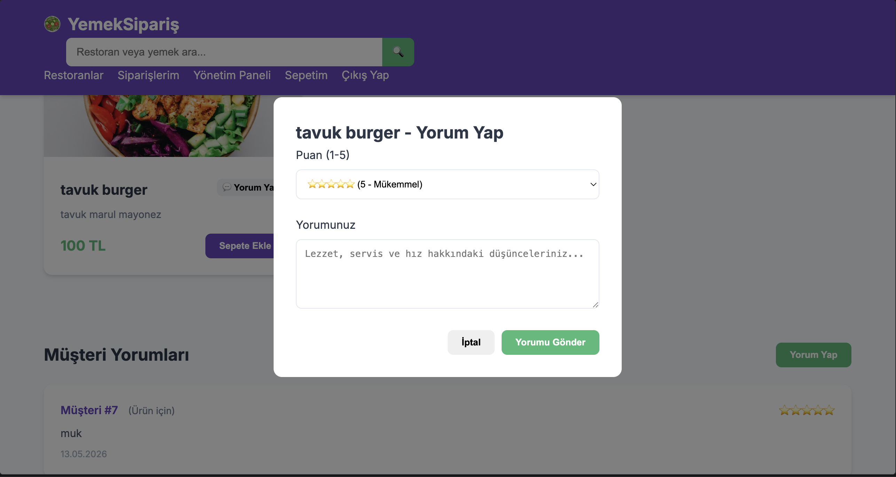

# 🌙  Yemek Sipariş Uygulaması

Bu proje, modern web teknolojileri kullanılarak geliştirilmiş kapsamlı bir **Yemek Sipariş Sistemi** backend ve frontend çalışmasıdır.

## 🚀 Özellikler
* **Kullanıcı Yönetimi:** Kayıt olma, giriş yapma ve profil yönetimi.
* **Restoran & Menü:** Restoran listeleme ve kategori bazlı ürün inceleme.
* **Sepet Sistemi:** Ürün ekleme, çıkarma ve miktar güncelleme.
* **Sipariş Takibi:** Verilen siparişlerin durumunu anlık kontrol etme.
* **Güvenlik:** FastAPI, JWT (JSON Web Token) ve Bcrypt ile güvenli şifreleme.

## 🛠 Kullanılan Teknolojiler
* **Backend:** Python, FastAPI, SQLAlchemy, Pydantic
* **Veritabanı:** SQLite / PostgreSQL
* **Frontend:** HTML, CSS, JavaScript
* **Diğer:** Git, venv, Requirements.txt

## 📦 Kurulum

1. Depoyu bilgisayarınıza indirin:
   ```bash
   git clone [https://github.com/Mehmet-Polatt/yemek_siparis_app.git](https://github.com/Mehmet-Polatt/yemek_siparis_app.git)


## 📸 Ekran Görüntüleri

### Login Sayfasi


### Kayit Sayfasi


### Restorant Sahibi Sayfasi


### Restorantlar Sayfasi


### Sepet Sayfasi


### Siparis Takip Sayfasi


### Yorum Sayfasi


